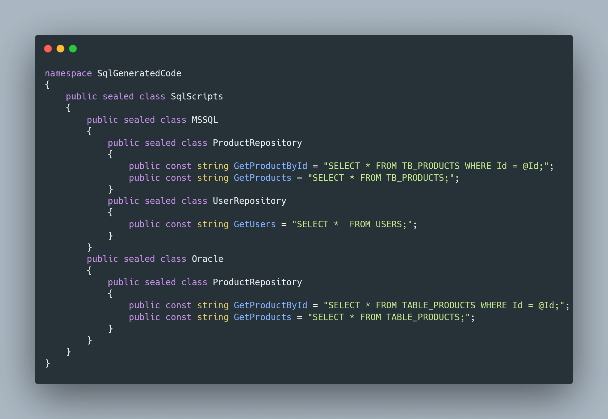

# EN (português abaixo)
## SourceGeneratorSample
A C# sample source generator that generates constant strings out of SQL files.

Did you know that in C#/.NET you can write code that writes code for you?

With Source Generators you can write code that will be run before your compilation process, enabling you to add code to your project automatically that would otherwise need to be written by hand.

In this repository I try to solve a simple problem I've met a few times before: how do you manage SQL scripts in your C# project? 

The number one solution I've seen is to have the scripts inside a C# class, but that makes them difficult to manage and harder to debug when you want the IDE to query the database directly. Not to mention the "code inside code" problem: having scripts from one language (SQL) inside scripts of another language (C#).

Another solution is to create a class that reads embeded SQL scripts during runtime, but that often requires the developer to know exactly the name of the script and where it's at. It also doesn't check if the script exists, so if the developer forgot to embed the resource or misstypes the script name it will fail during runtime.

This source generator aims to fix both problems: with it, the SQL scripts can exist in their own files and their own folders and still be accessible in C# during compilation time, this means if a script is missing the program won't even compile and you can get code assistance from your IDE to "explore" the scripts. It also means you don't need to read embeded resources since Roslyn will "inject" a class during compilation of your project with all your SQL scripts.
To have your SQL files recognized by the generator, simply add them to the project and set their build action to "AdditionalFiles", [like this](https://github.com/WashingtonARamos/SourceGeneratorSample/blob/5da9a2d579b69a31e17d5dd1810dac230dc6e2e6/EntryPoint/EntryPoint.csproj#L22).

This is how the generated code for this project looks like:

# PT
## SourceGeneratorSample
Um source generator que gera strings a partir de arquivos SQL.

Você sabia que no C#/.NET é possível escrever código que escreve código?

Com Source Generators você pode escrever código que será rodado antes mesmo do processo de compilação, permitindo que você adicione código ao seu projeto de maneira automática, sem que este precise ser escrito à mão.

Neste repositório eu tento solucionar um problema bastante recorrente em projetos que trabalho: como gerenciar scripts SQL nos projetos C#?

A solução mais comum que vejo é ter os scripts dentro das classes do C#, mas isto os torna difíceis de gerenciar e debugar, como quando sua IDE te dá suporte a executar scripts diretamente contra o banco de dados. Outro problema é o de "código dentro de código": ter scripts de uma linguagem (SQL) dentro de scripts doutra linguagem (C#).

Outra solução é criar uma classe que lê em runtime arquivos embedados ao projeto, mas isso geralmente requer que o desenvolvedor saiba exatamente o caminho até o script e seu nome. Este solução também não checa se o arquivo existe ou não, de maneira que se o desenvolvedor fizer um typo no nome do arquivo (ou caminho até ele) ou esquecer de embedar o arquivo, ocorrerão erros em runtime.

Este source generator tenta solucionar ambos os problemas: com ele, os scripts SQL podem ser salvos em arquivos separados e ainda assim serem acessíveis no código C#, durante a compilação. Isto significa que se algum script não estiver presente o projeto sequer compilará e uma vez que as classes estão disponíveis durante a compilação, você poderá receber assistência da sua IDE para explorar os scripts. Você também não precisará ler arquivos embedados uma vez que as classes serão injetadas antes mesmo da compilação.
Para que seus arquivos SQL sejam reconhecidos pelo gerador, basta adiciona-los ao projeto e setar seus build action como "AdditionalFiles", [assim](https://github.com/WashingtonARamos/SourceGeneratorSample/blob/5da9a2d579b69a31e17d5dd1810dac230dc6e2e6/EntryPoint/EntryPoint.csproj#L22).

Esta é a classe gerada para o projeto como ele está:

